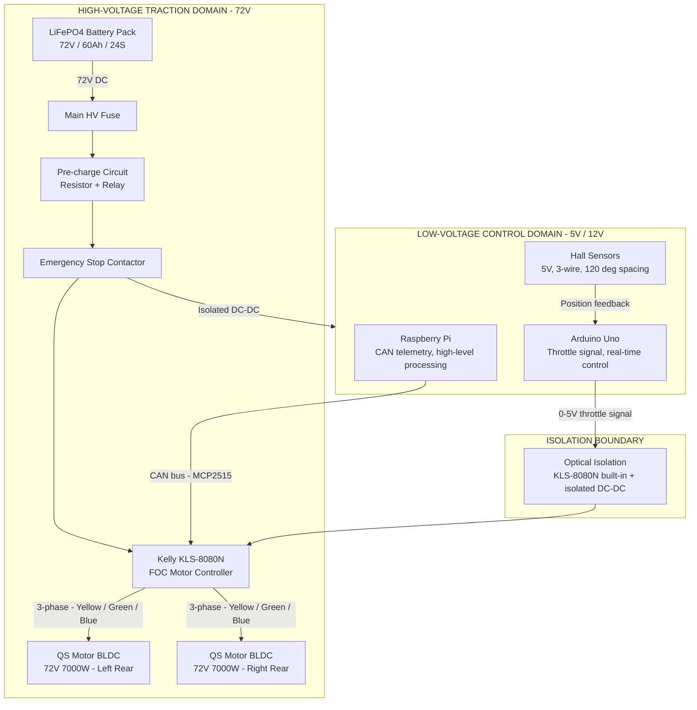
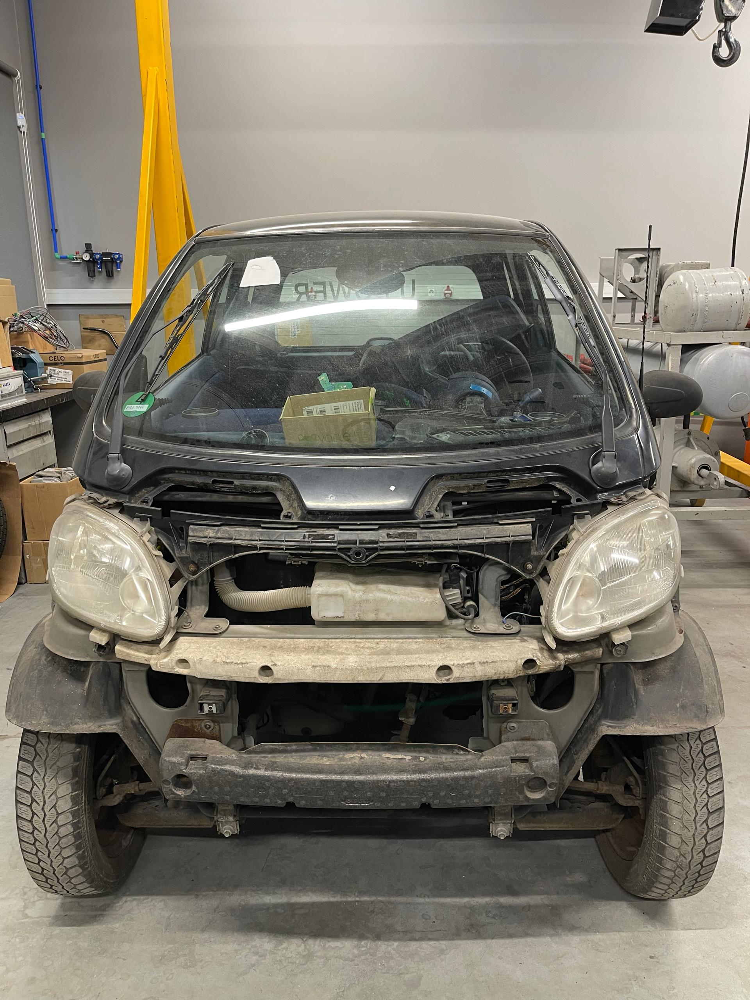
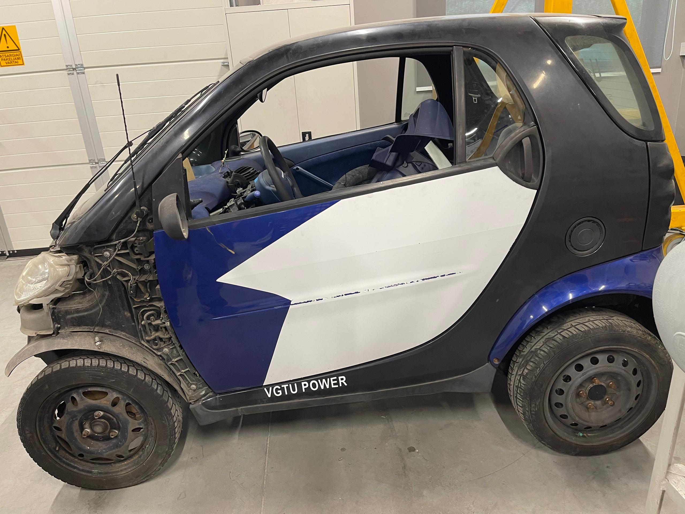
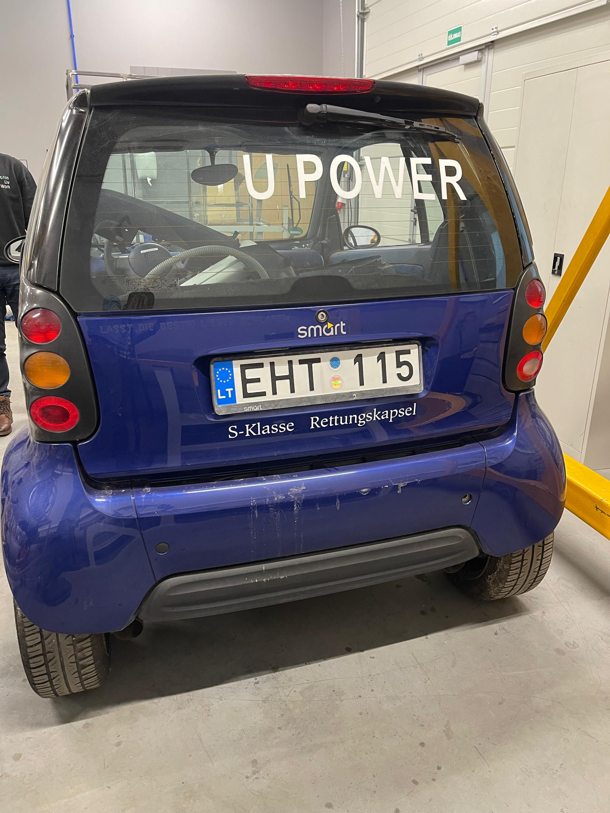
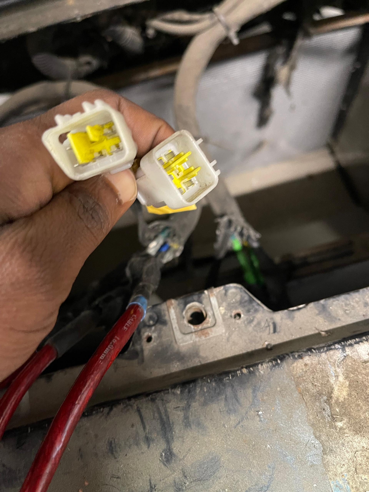
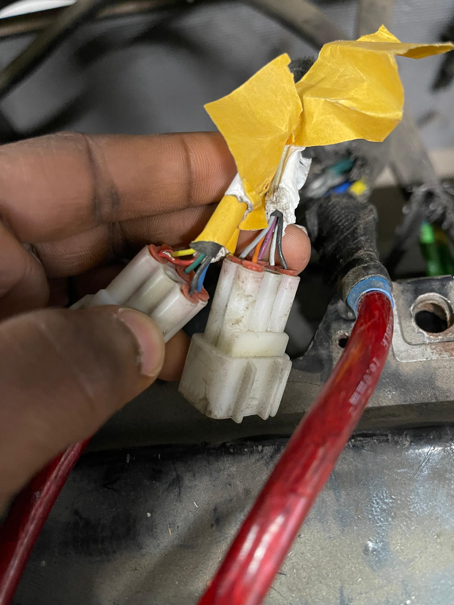
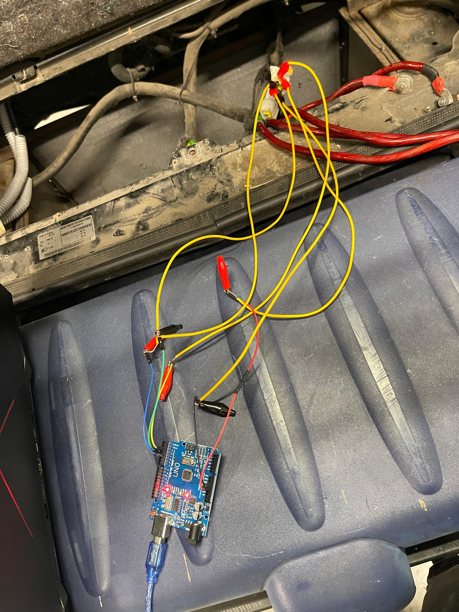
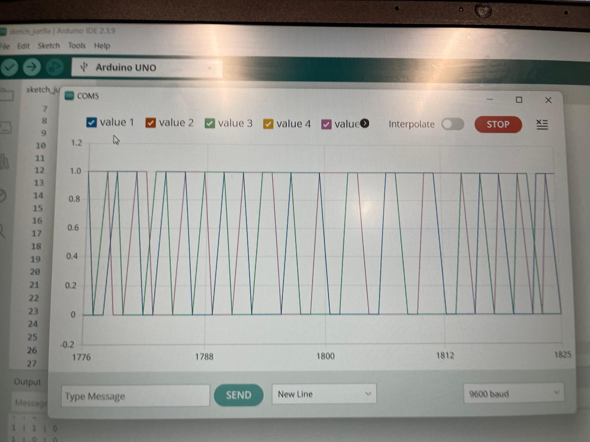

# Modular High-Power EV Research Platform

> **⚠️ ACTIVE RESEARCH PROJECT — Last updated: June 2026**
> This is a living document. Progress is updated after every significant test, procurement decision, or integration milestone.

**A ground-up EV conversion and intelligent control research platform built on a first-generation Smart Fortwo (MC01) chassis at the Vilnius Gediminas Technical University (VGTU) Automotive Engineering Laboratory, under an Erasmus+ traineeship.**

The platform is designed as a modular research vehicle for embedded systems experimentation, drive-by-wire development, and intelligent vehicle control — not a road vehicle. The first-generation MC01 was ICE-only from the factory; there is no OEM EV powertrain to reference. Every electrical and electronic subsystem is being specified, procured, and integrated from the ground up.

**Role on this project:** Embedded systems and electronics lead — sole responsibility for all electrical architecture decisions, component selection, hardware characterisation, and embedded firmware.

---

## Project Status

| Subsystem | Status |
|---|---|
| Vehicle platform (Smart Fortwo MC01) | ✅ Confirmed — chassis in lab |
| Traction motors (QS Motor BLDC 72V 7000W ×2) | ✅ Confirmed — all health tests passed |
| Motor controller (Kelly KLS-8080N) | 🔄 In procurement — Miromax, Vilnius |
| Battery pack (72V 60Ah LiFePO4) | 🔄 Specification complete — procurement pending |
| Battery charger (matched 24S LiFePO4) | 🔄 Mandatory co-purchase — pending |
| HV protection architecture (fuse, pre-charge, contactor) | ⏳ Design phase — not yet started |
| HV/LV isolation interface | ⏳ Not yet designed |
| Arduino throttle signal interface | ⏳ Can prototype now — independent of HV |
| CAN telemetry (Raspberry Pi + MCP2515) | ⏳ Future phase |
| Steering actuation (electronic) | ⏳ Future phase |

---

## System Architecture

The platform uses a **dual-domain electrical architecture** — a hard separation between the high-voltage traction domain and the low-voltage control domain, bridged only through optical isolation. This is not a design convenience; it is a safety requirement before any powered testing can begin.



**Key architecture decisions already locked:**
- **Optical isolation at the HV/LV boundary** — the KLS-8080N provides built-in optical isolation for the control signal path; an isolated DC-DC converter is additionally required to power the LV domain from the main battery without creating a ground path between domains
- **FOC sinusoidal control mandatory** — selected over trapezoidal control for smoother torque delivery and lower acoustic noise, relevant for a research platform where motor behaviour needs to be clean and characterisable
- **CAN bus telemetry** — the KLS-8080N's integrated CAN broadcast enables the Raspberry Pi to log live motor speed, current, and temperature without polling overhead
- **Dual motor configuration** — two QS Motor units, one per rear wheel, on the drive axle

---

## Hardware Reality (BOM)

### Vehicle Platform

| Parameter | Value | Status |
|---|---|---|
| Base vehicle | Smart Fortwo MC01, first generation | Confirmed |
| VIN | WME01MC01YHO05839 | Confirmed |
| Structure | Tridion steel safety cell | Confirmed |
| Wheelbase | 1,812 mm | Confirmed |
| Max GVW | 980 kg (front 427 kg / rear 610 kg) | Confirmed |
| OEM powertrain | Removed — ICE-only in MC01 generation | Confirmed |
| Front tyres | 145/65 R15 (steering axle) | Confirmed |
| Rear tyres | 175/55 R15 (drive axle) | Confirmed |
| Rear rolling circumference | ~1.802 m | Confirmed |

### Traction Motors

| Parameter | Value | Status |
|---|---|---|
| Manufacturer | Quanshun (QS Motor) | Confirmed — motor label |
| Label | QUANSHUN 72V 7000W | Confirmed |
| Internal code | 121215 | Confirmed — 121mm stator / 215mm axle width |
| Type | BLDC hub motor, large-diameter car motor series | Confirmed |
| Placement | Rear axle (drive axle), one per wheel | Confirmed |
| Nominal voltage | 72V DC | Confirmed |
| Rated power | 7,000W (7kW) per unit | Confirmed |
| Phase wires | Yellow, Green, Blue (3-phase) | Confirmed — physically observed |
| Hall connector | Standard 5-wire (5V, GND, Hall A, Hall B, Hall C) | Confirmed |
| Hall spacing | 120° electrical | Confirmed — QS Motor standard |
| Continuous battery current demand | ~97A | Calculated: 7000W ÷ 72V |
| Peak battery current | ~250A | Engineering estimate |

>
>
>
>
> 
> 
> ```

### Motor Controller (In Procurement)

| Parameter | KLS-8080N | Requirement | Status |
|---|---|---|---|
| Supplier | Miromax (UAB MIROMAX, Vilnius) | EU-local | ✅ Confirmed |
| Voltage range | 24–72V (configurable to 90V max) | Must include 72V | ✅ Pass |
| Continuous current | 200A | ≥100A | ✅ Pass — margin confirmed |
| Peak current | 500A | ≥250A | ✅ Pass — margin confirmed |
| Control method | FOC sinusoidal | FOC mandatory | ✅ Pass |
| Hall interface | 120°, 5V standard | 120°, 5V — confirmed on motor | ✅ Pass |
| CAN bus | Yes — integrated broadcast | Strongly recommended | ✅ Pass |
| Regenerative braking | Yes | Strongly recommended | ✅ Pass |
| PC programming | Yes — via KLS-ACC-PC cable | Required | ✅ Pass |
| Optical isolation | Yes — built-in | Safety requirement | ✅ Pass |

### Battery Pack (Specification Complete — Procurement Pending)

| Parameter | Specification | Rationale |
|---|---|---|
| Chemistry | LiFePO4 | Thermal stability, long cycle life, safest for repeated lab cycling |
| Configuration | 24S (24 cells in series) | Industry standard for 72V-class lithium systems |
| Nominal voltage | 72–77V | Matches motor and controller rating |
| Maximum charge voltage | ≤88V | Hard ceiling — controller 90V max |
| Discharge cut-off | ≥60V (2.5V/cell × 24) | Prevents over-discharge damage |
| Continuous discharge | ≥100A | Must exceed motor ~97A demand |
| Peak discharge | ≥250A for ≥10 seconds | Motor peak acceleration demand |
| Capacity | ≥50Ah (60Ah recommended) | ~30–35 minutes full-load test duration |
| BMS | Mandatory — integrated | Non-negotiable for any lithium chemistry |
| BMS communication | CAN, RS485, or UART | Raspberry Pi telemetry integration |
| Enclosure | Sealed rigid case | Workshop mechanical protection |

> ⚠️ A matched 24S LiFePO4 charger (≤88V output, 20–30A recommended) is a mandatory co-purchase. The incompatible lab asset (Blue Shock Race Li-ion 96V/28Ah) was identified and ruled out — 96V exceeds both the motor and controller maximum ratings.

### Control & Compute

| Component | Role | Status |
|---|---|---|
| Arduino Uno | Real-time embedded control, throttle signal generation, sensor polling | Available — actively used |
| Raspberry Pi | High-level processing, CAN bus telemetry, data logging | Available |
| MCP2515 CAN module | CAN bus interface for Raspberry Pi | Future phase |
| NEMA 23/34 stepper motors | Lab actuator experiments | Available |
| 3D printer | Custom bracket and mount fabrication | Available |
| 10:1 and 20:1 planetary gearboxes | Available for drivetrain experiments | Available |

---

## Challenges & Debugging

**1. Controller sourcing — China supply chain rejected, local EU supplier identified**

The initial specification targeted the Fardriver ND72850 as the motor controller. When procurement research began, it became clear that Fardriver is a China-based manufacturer — long lead times, customs/import duty risk, and high international shipping costs made it incompatible with the university procurement timeline.

- **Decision process:** Kelly Controllers were evaluated as an alternative and ruled out for the same reason (also China-based, +86 support contact). Research then focused on EU-local suppliers stocking comparable FOC sinusoidal controllers rated for 72V/500A peak.
- **Resolution:** Miromax (UAB MIROMAX, Vilnius) was identified — a Lithuanian company that already lists VGTU as an institutional client on their website, stocks the Kelly KLS-8080N from inventory, and offers 24-hour delivery with €9 local shipping and EU VAT invoicing. All technical specifications were verified against the motor and system requirements before the sourcing decision was finalised.

**2. Phase resistance measurement — standard multimeter insufficient**

Winding continuity testing with a standard multimeter showed low, roughly equal resistance across all three phase pairs — but the readings were too low to be reliable, because the measurement included the test lead resistance (~0.4Ω each side).

- **Root cause:** A standard multimeter's minimum resolution is typically 0.1–1Ω, which is comparable to or larger than the actual phase resistance of a large hub motor. Lead resistance correction is required, but it brings the corrected result below the meter's useful resolution.
- **Status:** Precise winding resistance measurement requires a milliohm meter. This test is logged as an open item — it does not block controller procurement, but is required for complete motor characterisation before final commissioning.

**3. Hall sensor wiring verification — Arduino-based live signal test**

With two QS Motor units to commission and no motor datasheet beyond the label, confirming that all three Hall sensors per motor were functional required an active test rather than continuity checking alone.

- **Method:** Arduino Uno configured as a Hall sensor interrogator — 5V supply to the Hall connector, three signal lines read on digital input pins with `INPUT_PULLUP`, serial output logging A/B/C state at 1ms intervals. Motor axle rotated slowly by hand.
- **Result:** All three Hall signals toggled cleanly between 0V and 5V across both motors — 120° electrical spacing confirmed, no stuck or floating signals.
- **Additional finding:** QS Motor V2 units carry a single 5-wire Hall connector per motor (not two independent sets). The orange wire present on both connectors was initially suspected to be a thermistor signal. This was disproved through temperature cycling and toggling tests — the orange wire showed no response to temperature change and no continuity pattern consistent with a thermistor. No thermistor is present on either motor. This has a direct implication: the Fardriver thermal protection configuration (had Fardriver been retained) would have needed adjustment; the KLS-8080N configuration must be set to operate without motor temperature feedback.

**4. Incompatible lab battery asset — identified and ruled out**

A Blue Shock Race Li-ion battery (96V, 28Ah, 2680Wh) was found in the lab and initially considered as a potential power source.

- **Decision:** Ruled out immediately — 96V nominal exceeds the motor's 72V rating and the KLS-8080N's 90V absolute maximum. Confirmed with the professor that this is an unrelated kart-racing lab asset and must not be connected to this system under any circumstances.
- **Outcome:** Battery procurement specification was written from scratch to match the 72V/24S LiFePO4 architecture, with the 90V controller ceiling as a hard upper bound.

**5. Mechanical inspection — non-rhythmic drag on one wheel**

During manual axle rotation testing, a non-rhythmic drag was noted on one of the rear wheels — distinct from the expected regular magnetic cogging of the motor.

- **Status:** Under investigation before any powered testing begins. The drag pattern is irregular, which rules out normal rotor reluctance as the cause. Possible causes include bearing condition, rotor alignment, or a mechanical issue in the hub integration. This will be resolved and documented before the first motor spin test.

---

## Resourcefulness, Safety Governance & AI Integration

While this is a student-driven research project—conducted without a dedicated electronics technician, direct manufacturer support, or a pre-existing institutional playbook for this specific EV conversion—it operates under strict academic and safety governance. I am responsible for researching and proposing solutions from first principles, utilizing datasheets, QS Motor documentation, and Kelly Controllers manuals.

However, I work in close collaboration with my advising Professor, Assoc. Prof. Dr. Vidas ŽURAULIS, and the Laboratory Head, Mr. Pavel Ževžikov. Every major architectural decision, component procurement, and—most critically—any design or testing involving High-Voltage (HV) traction systems requires their active review, expertise, and explicit authorization before execution. No powered testing or HV integration occurs without their direct oversight.

AI assistance has been used for boilerplate acceleration where appropriate—such as Arduino sketch scaffolding for the Hall sensor test, initial procurement document formatting, and researching EU-local EV component suppliers. However, the core engineering judgment—determining what to test, interpreting the results, defining safety boundaries, and presenting actionable data to the faculty for approval—remains my own.

The Hall sensor test code is a representative example: the Arduino sketch itself is straightforward; the actual engineering value lies in knowing why the test is necessary, understanding how 120-degree electrical timing prevents inverter phase faults, and empirically proving system health to the faculty before requesting authorization to connect HV power.

---

## Embedded Firmware — Hall Sensor Characterisation Test

**EXP-002: Hall Sensor Function Verification (Arduino)**


**What this test confirmed:**
- All six Hall sensors (3 per motor × 2 motors) toggle cleanly between logic HIGH and LOW during slow axle rotation
- Signal transitions occur at the expected 60° mechanical intervals (120° electrical for a 2-pole-pair hub motor)
- No stuck signals, floating pins, or dead sensors detected on either unit
- `INPUT_PULLUP` used deliberately — QS Motor Hall outputs are open-collector, requiring a pull-up to read cleanly; without it, floating inputs would produce false readings that could be mistaken for sensor failures

Test Setup Photos:

> 
> 

---

## Electrical Architecture Diagrams

> 📁 **Add architecture and wiring photos here:**
> ```markdown
> 
> 
> 
> 
> ```

---

## Roadmap

### Phase 1 — Component Procurement & Bench Validation *(Current)*
- [ ] Procure Kelly KLS-8080N from Miromax + programming cable
- [ ] Write and submit battery procurement specification
- [ ] Prototype Arduino 0–5V throttle signal circuit (no HV required)
- [ ] Milliohm meter measurement of phase winding resistance
- [ ] Resolve non-rhythmic drag on rear wheel

### Phase 2 — Protection Architecture & First Spin *(After procurement)*
- [ ] Design HV protection architecture: main fuse, pre-charge resistor + relay, emergency stop contactor
- [ ] Design and implement HV/LV isolation (isolated DC-DC converter)
- [ ] First motor bench spin test — with professor present, current-limited via KLS-ACC-PC
- [ ] Define and document safe test envelope before power-on

### Phase 3 — Telemetry & Control Integration
- [ ] CAN bus telemetry implementation (Raspberry Pi + MCP2515)
- [ ] Live data logging: motor speed, current, temperature, battery state
- [ ] Arduino throttle-to-CAN integration

### Phase 4 — Drive-by-Wire & Intelligent Control
- [ ] Steering torque characterisation (Smart Fortwo MC01 geometry)
- [ ] Steering actuator selection and mounting
- [ ] Braking system feasibility study
- [ ] Intelligent vehicle control experiments

---

## Documentation Log

| Document | Status |
|---|---|
| Motor Controller Procurement Specification | ✅ Complete — in professor review |
| Motor Controller Sourcing Decision Log | ✅ Complete — Miromax KLS-8080N selected |
| Motor Health Test Record (EXP-001, EXP-002) | ✅ Complete |
| OEM Reference Comparison (Smart ED 451) | ✅ Complete |
| System Architecture Block Diagram | ✅ Complete — living document |
| Battery Pack Procurement Specification | 🔄 Drafted — standalone document pending |
| HV Protection Architecture Design | ⏳ Not yet started |

---

## Lab & Institutional Context

**Institution:** Vilnius Gediminas Technical University (VGTU), Automotive Engineering Laboratory
**Programme:** Erasmus+ Traineeship
**Supervisor:** Professor, VGTU Automotive Engineering Laboratory
**Platform:** First-generation Smart Fortwo MC01 — VIN WME01MC01YHO05839

This project is supervised by academic research. All procurement, high-voltage design, and powered testing decisions are subject to professor review and sign-off before implementation.
